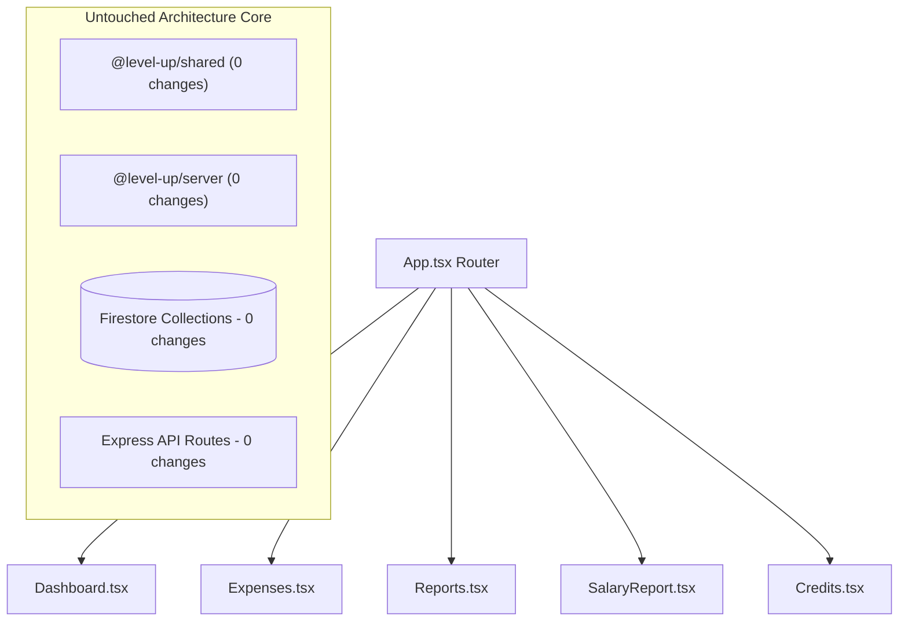

# M-112 Blast Radius & Plan Correctness Report

**Mission:** M-112 Cross-Flow State Synchronization & Range Guard Hardening  
**Proposal:** ACP-020  
**Generated:** 2026-09-22  
**Status:** Pre-Execution Architecture Review  

---

## 1. Changed-File Manifest

### Client Presentation Layer (5 Leaf Components)
1. `packages/client/src/pages/Dashboard.tsx`
   - **Change:** Add `isSubmittingFloat` state, disable "Save" button during submission, and validate `floatAmount >= 0` pre-flight.
2. `packages/client/src/pages/Expenses.tsx`
   - **Change:** Add `isWithinActiveRange` filter-containment check on expense create and edit.
3. `packages/client/src/pages/Reports.tsx`
   - **Change:** Add `From <= To` validation check, disable Apply button when invalid, and render an inline warning.
4. `packages/client/src/pages/SalaryReport.tsx`
   - **Change:** Add `From <= To` validation check, disable Apply button when invalid, and render an inline warning.
5. `packages/client/src/pages/Credits.tsx`
   - **Change:** Check active `filterEmployeeId` before prepending new/updated credit to the local history list.

### Test Files (4 Files)
1. `packages/client/src/__tests__/pages/Dashboard.test.tsx` — verify button disabled during float update.
2. `packages/client/src/__tests__/pages/Expenses.test.tsx` — verify out-of-range backdated expense is not prepended to filtered list.
3. `packages/client/src/__tests__/pages/Reports.test.tsx` — verify Apply button disabled when `inputStartDate > inputEndDate`.
4. `packages/client/src/__tests__/pages/SalaryReport.test.tsx` — verify Apply button disabled when `inputStartDate > inputEndDate`.

---

## 2. Structural Dependency & Impact Propagation Analysis

### Blast Radius Containment Findings:
1. **Leaf Component Isolation:**
   - All 5 modified files are terminal leaf nodes in the React tree. They are only imported by `App.tsx` inside React Router route definitions.
   - Nothing in `packages/shared`, `packages/server`, or `packages/client/src/lib/` imports from these page components.
2. **Zero Contract / API Mutation:**
   - No HTTP endpoints, request bodies, or response schemas are modified.
   - All existing API endpoints (`POST /api/expenses`, `PUT /api/shifts/:id/float`, `GET /api/reports`, etc.) retain their exact contracts.
3. **Strictly Additive UI Safeguards:**
   - The changes only prevent invalid actions:
     - Disabling a button while a request is already flying (preventing duplicate network calls).
     - Disabling an apply button when `From > To` (preventing meaningless `startDate > endDate` queries).
     - Checking range containment before prepending to local state (preventing temporary state desync with server records).
4. **Timezone Determinism:**
   - `isWithinActiveRange` uses `getShopDateString(new Date(date))` which explicitly formats in `Africa/Addis_Ababa` time (+03:00).
   - Validated against existing date helpers in `dateUtils.ts` (tested and proven in M-90/M-92).

---

## 3. Risk Assessment & Non-Regression Guarantees

| Area | Potential Failure Mode | Containment & Verification |
| :--- | :--- | :--- |
| **Existing Tests** | Could adding `isWithinActiveRange` break existing expense tests? | **Verified No.** Existing tests use `new Date().toISOString()` which matches today's date and passes `isWithinActiveRange`. All 30 tests in `Expenses.test.tsx` will remain green. |
| **Same-Day Date Ranges** | Does `inputStartDate <= inputEndDate` permit same-day reports (`From == To`)? | **Verified Yes.** `<=` evaluates to true when dates are equal (e.g., `2026-09-22 <= 2026-09-22`). Same-day single shift reports function normally. |
| **Double Clicks on Float** | Does `isSubmittingFloat` recover if the API fails? | **Verified Yes.** Wrapped in `try ... finally { setIsSubmittingFloat(false) }`, ensuring the button re-enables on error. |
| **Playwright E2E** | Does `store_operations_cycle.spec.ts` encounter any blocked actions? | **Verified No.** E2E tests provide valid, matching dates and non-negative numbers, executing seamlessly through all gates. |

---

## 4. Conclusion
The proposed plan has a strictly contained blast radius confined to 5 client page components. No architectural, server, database, or shared type boundaries are crossed. The risk of unintended regression is near zero.
