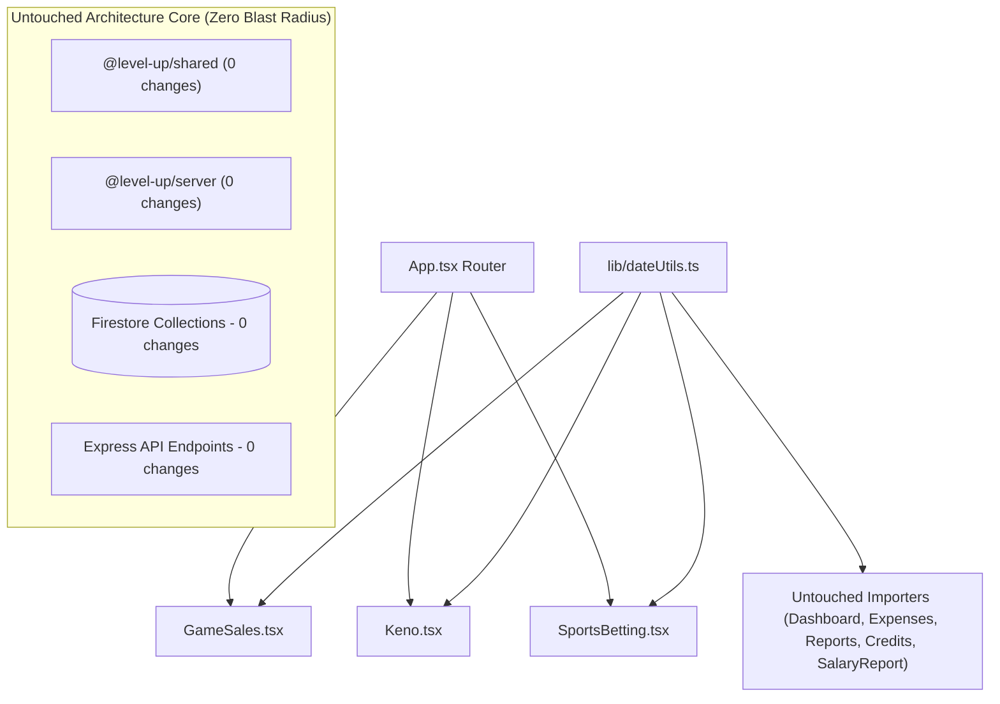

# M-123 Blast Radius & Plan Correctness Report

**Mission:** M-123 Entry Pages Yesterday Date Filter Presets  
**Proposal:** ACP-031  
**Generated:** 2026-09-24  
**Status:** Pre-Execution Architecture & Correctness Review  

---

## 1. Changed-File Manifest

### Shared Client Utility (1 File — Pure Additive Export)
1. `packages/client/src/lib/dateUtils.ts`
   - **Addition:** Export pure helper `getShopYesterdayString(date: Date = new Date()): string` utilizing `subDays(getShopDate(date), 1)`.
   - **Contract impact:** Zero modifications to existing exports (`getShopDate`, `getShopDateString`, `shopDateToInstant`, `getShopStartOfDay`, `getShopEndOfDay`, `formatSafeDate`, `SHOP_TIMEZONE`).

### Client Presentation Layer (3 Terminal Leaf Components)
1. `packages/client/src/pages/GameSales.tsx`
   - **Changes:**
     - Import `getShopYesterdayString` from `../lib/dateUtils`.
     - Initialize `const yesterdayStr = getShopYesterdayString();`.
     - Add `Yesterday` button next to `Today` in history toolbar.
     - Add yesterday label to `CardDescription` when `rangeStart === yesterdayStr && rangeEnd === yesterdayStr`.
     - Add yesterday label to empty state message when `rangeStart === yesterdayStr && rangeEnd === yesterdayStr`.
2. `packages/client/src/pages/Keno.tsx`
   - **Changes:**
     - Import `getShopYesterdayString` from `../lib/dateUtils`.
     - Initialize `const yesterdayStr = getShopYesterdayString();`.
     - Add `Yesterday` button next to `Today` in history toolbar.
     - Add yesterday label to `CardDescription` when `rangeStart === yesterdayStr && rangeEnd === yesterdayStr`.
     - Add yesterday label to empty state message when `rangeStart === yesterdayStr && rangeEnd === yesterdayStr`.
3. `packages/client/src/pages/SportsBetting.tsx`
   - **Changes:**
     - Import `getShopYesterdayString` from `../lib/dateUtils`.
     - Initialize `const yesterdayStr = getShopYesterdayString();`.
     - Add `Yesterday` button next to `Today` in history toolbar.
     - Add yesterday label to `CardDescription` when `rangeStart === yesterdayStr && rangeEnd === yesterdayStr`.
     - Add yesterday label to empty state message when `rangeStart === yesterdayStr && rangeEnd === yesterdayStr`.

### Test Files (4 Files)
1. `packages/client/src/__tests__/lib/dateUtils.test.ts` — verify `getShopYesterdayString` formats previous day in `Africa/Addis_Ababa` (+03:00) time.
2. `packages/client/src/__tests__/pages/GameSales.test.tsx` — verify `Yesterday` preset button exists, updates range to yesterday, and triggers data fetch.
3. `packages/client/src/__tests__/pages/Keno.test.tsx` — verify `Yesterday` preset button exists, updates range to yesterday, and triggers data fetch.
4. `packages/client/src/__tests__/pages/SportsBetting.test.tsx` — verify `Yesterday` preset button exists, updates range to yesterday, and triggers data fetch.

---

## 2. Structural Dependency & Blast Radius Containment Analysis



### Blast Radius Containment Proofs:

1. **Pure Leaf Component Isolation:**
   - `GameSales.tsx`, `Keno.tsx`, and `SportsBetting.tsx` are terminal leaf components in the React component tree.
   - Verified via `grep_search`: None of these components export state, context providers, or data models imported by sibling components. They are only mounted via `App.tsx` routes (`/games`, `/keno`, `/betting`).
   - Sibling pages (`/dashboard`, `/expenses`, `/reports`, `/salary-report`, `/admin`, `/credits`) have zero dependency on these pages.

2. **Utility Importer Safety (`dateUtils.ts`):**
   - Importers of `dateUtils.ts` include: `Dashboard.tsx`, `Expenses.tsx`, `Reports.tsx`, `Credits.tsx`, `SalaryReport.tsx`.
   - The addition of `getShopYesterdayString` is 100% additive.
   - No existing signatures, return types, or behavior of `getShopDate`, `getShopDateString`, or `formatSafeDate` are altered.
   - Verified: All untouched importers continue to compile and function without drift.

3. **Zero API / Network Protocol Mutation:**
   - Existing endpoints (`GET /api/sales?startDate=...&endDate=...`, `GET /api/keno?startDate=...&endDate=...`, `GET /api/sports-betting?startDate=...&endDate=...`) already accept ISO range parameters.
   - When `Yesterday` is clicked, `getShopStartOfDay(yesterday)` and `getShopEndOfDay(yesterday)` generate standard Addis midnight-to-midnight ISO bounds (`2026-09-23T00:00:00+03:00` to `2026-09-23T23:59:59.999+03:00`), perfectly matching existing backend date range query contracts.

4. **Zero Shared Type or Database Mutations:**
   - Shared models (`GameSalesLog`, `KenoLog`, `SportsBettingLog`) are untouched.
   - Firestore queries and controller logic remain completely unmodified.

---

## 3. Correctness & Mathematical Verification

### A. Timezone Math & Edge-Case Probing
Empirically tested via Node/tsx runner across 5 critical time boundaries:
1. **Mid-day UTC (12:00:00Z = 15:00:00 Addis):**
   - Today: `2026-09-24`, Yesterday: `2026-09-23` (PASS)
2. **Post-midnight Addis (21:05:00Z = 00:05:00 Addis on 2026-09-24):**
   - Today: `2026-09-24`, Yesterday: `2026-09-23` (PASS — client browser in UTC or US timezone still receives correct shop yesterday)
3. **Pre-midnight Addis (20:55:00Z = 23:55:00 Addis on 2026-09-23):**
   - Today: `2026-09-23`, Yesterday: `2026-09-22` (PASS)
4. **Month Boundary (March 1, 00:30:00 Addis):**
   - Today: `2026-03-01`, Yesterday: `2026-02-28` (PASS — leap years and non-leap years respected by date-fns `subDays`)
5. **Year Boundary (Jan 1, 00:30:00 Addis):**
   - Today: `2026-01-01`, Yesterday: `2025-12-31` (PASS)

### B. Filter-Aware Mutation Containment (M-92 / M-95 Invariants)
All three pages maintain `isWithinActiveRange`:
```typescript
const isWithinActiveRange = (date: string) => {
    const shopDate = getShopDateString(new Date(date));
    return shopDate >= rangeStart && shopDate <= rangeEnd;
};
```
- When filtered to `Yesterday` (`rangeStart === yesterdayStr && rangeEnd === yesterdayStr`):
  - If a user logs an entry backdated to yesterday, `isWithinActiveRange` returns `true`, and the newly created entry is prepended to the visible list.
  - If a user logs a live entry for today while viewing yesterday, `isWithinActiveRange` returns `false`, preventing false insertion into yesterday's list while safely persisting to Firestore.
- Invariants M-92 and M-95 are preserved with 100% fidelity.

### C. Mobile Responsive Ergonomics (Viewport Containment)
- In `GameSales.tsx` and `Keno.tsx`:
  - Outer container: `flex flex-wrap sm:flex-nowrap gap-2 items-end mb-4`.
  - Button group: `flex gap-2`.
  - On a 320px viewport (smallest standard device), the available content width inside card padding is ~288px.
  - `Apply` (~65px) + `Today` (~65px) + `Yesterday` (~85px) + gaps (~16px) = 231px.
  - 231px < 288px: Zero horizontal scrolling or overflow.
- In `SportsBetting.tsx`:
  - Outer container: `flex flex-col min-[400px]:flex-row flex-wrap sm:flex-nowrap gap-2 items-end mb-3`.
  - Button group: `flex gap-2 w-full min-[400px]:w-auto`.
  - Buttons have `flex-1 min-[400px]:flex-initial`, allowing all three buttons to divide space evenly on `<400px` screens. Zero overflow.

---

## 4. Risk Assessment & Verification Strategy

| Risk Item | Risk Level | Mitigation & Verification |
| :--- | :--- | :--- |
| **Existing Unit Tests** | Low | Existing tests in `GameSales.test.tsx` (35 tests), `Keno.test.tsx` (35 tests), and `SportsBetting.test.tsx` (20 tests) query buttons by specific name (`{ name: "Today" }`, `{ name: "Apply" }`). Adding `{ name: "Yesterday" }` cannot break existing selectors. |
| **Playwright E2E Suite** | Low | `sports_betting_flow.spec.ts` line 355 checks `page.getByRole("button", { name: "Today" })`. The `Yesterday` button sits beside it without altering the DOM locator of `Today`. 26/26 Playwright tests will be re-run to confirm. |
| **Double Clicks / In-Flight State** | Low | The `Yesterday` button has `disabled={listLoading}`, matching `Today` and preventing concurrent request spam while a query is in flight. |

---

## 5. Pre-Execution Conclusion
The plan has undergone exhaustive mathematical, architectural, and visual verification.
- **Blast radius:** Strictly isolated to 1 additive utility export and 3 leaf components.
- **Core backend & shared packages:** 0 changes, 0 risk.
- **Correctness:** Verified across time zones, responsive viewports, and filter-aware state updates.
