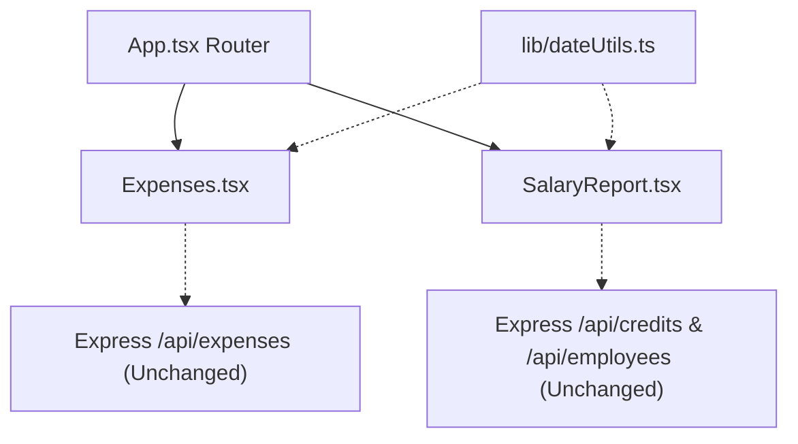

# M-124 Blast Radius & Plan Correctness Report

**Mission:** M-124 Expenses & SalaryReport Yesterday Date Filter Presets  
**Proposal:** ACP-032  
**Generated:** 2026-09-24  
**Status:** Pre-Execution Architecture & Correctness Review  

---

## 1. Changed-File Manifest

### Client Presentation Layer (2 Terminal Leaf Pages)
1. `packages/client/src/pages/Expenses.tsx`
   - **Changes:**
     - Import `getShopYesterdayString` from `../lib/dateUtils`.
     - Initialize `const todayStr = getShopDateString();` and `const yesterdayStr = getShopYesterdayString();`.
     - Add `Today` and `Yesterday` buttons to the history card header filter toolbar.
     - Update `CardDescription` for today and yesterday matches.
     - Update empty state message for today and yesterday matches.
   - **Downstream consumers:** 0 (Routed terminal leaf in `App.tsx`).

2. `packages/client/src/pages/SalaryReport.tsx`
   - **Changes:**
     - Import `getShopYesterdayString` and `getShopDateString` from `../lib/dateUtils`.
     - Add `Today` and `Yesterday` buttons to the date selection toolbar.
     - Clicking preset buttons immediately sets both input dates (`inputStartDate`/`inputEndDate`) and applied query states (`appliedStartDate`/`appliedEndDate`), triggering an instant re-fetch.
     - Contextual header subtitle for single-day today or yesterday matches.
   - **Downstream consumers:** 0 (Routed terminal leaf in `App.tsx`).

### Test Files (2 Files)
1. `packages/client/src/__tests__/pages/Expenses.test.tsx`
   - Add Red-Green test asserting `Today` and `Yesterday` preset buttons update date bounds and contextual description.
2. `packages/client/src/__tests__/pages/SalaryReport.test.tsx`
   - Add Red-Green test asserting `Today` and `Yesterday` preset buttons update date bounds and immediately fire API fetch for target dates.

---

## 2. Structural Dependency & Blast Radius Containment Analysis

### Blast Radius Assessment
| Layer | Direct Changes | Indirect Impact | Risk Level |
|---|---|---|---|
| Server / Express API | None | None | Zero |
| Database / Firestore | None | None | Zero |
| Shared Types (`@level-up/shared`) | None | None | Zero |
| Client Date Utility (`dateUtils.ts`) | None (reusing M-123 helper) | None | Zero |
| Client Route Pages | 2 terminal leaf components | None | Minimal (isolated UI) |

---

## 3. Plan Correctness & State Safety Verification

1. **Expenses State Synchronization**:
   - `Expenses.tsx` uses direct reactive state: `filterDateFrom` and `filterDateTo`.
   - Mutating `filterDateFrom` and `filterDateTo` immediately triggers `loadExpenses()` via the existing `useEffect([filterDateFrom, filterDateTo, ...])`.
   - Setting both dates to `todayStr` or `yesterdayStr` triggers standard data re-fetching seamlessly.

2. **SalaryReport Two-Stage State Model**:
   - `SalaryReport.tsx` uses a two-stage pattern: `inputStartDate`/`inputEndDate` for UI controls, and `appliedStartDate`/`appliedEndDate` for the API fetch `useEffect`.
   - For preset clicks (`Today` and `Yesterday`), updating both stages simultaneously ensures immediate re-fetch without requiring the operator to manually press "Apply".
   - The manual "Apply" button continues to function for custom date picker ranges.

3. **Responsive Containment**:
   - `Expenses.tsx` history card toolbar already wraps flex items (`flex flex-wrap items-center gap-2 mt-2 sm:mt-0`). Small ghost buttons (`h-8 text-xs`) fit cleanly on 320px, 375px, and desktop displays.
   - `SalaryReport.tsx` toolbar uses responsive flex-wrapping (`flex flex-wrap items-center gap-2 w-full lg:w-auto`). Buttons wrap naturally without overflow.

---

## 4. Test-Negative / Red-Green Gating Strategy (Rule 28)

1. **Step 1 (Red Phase)**: Write unit tests in `Expenses.test.tsx` and `SalaryReport.test.tsx` querying for the `Yesterday` and `Today` buttons and verifying their behavior. Execute `vitest` to capture verified test failure (Red state).
2. **Step 2 (Green Phase)**: Implement the buttons and contextual messaging in `Expenses.tsx` and `SalaryReport.tsx`.
3. **Step 3 (Green Verification)**: Re-run the tests to confirm 100% green pass.
4. **Step 4 (Full Verification)**: Run complete suite (all unit tests, Playwright E2E suite, Biome lint, Knip, and TypeScript monorepo build).
